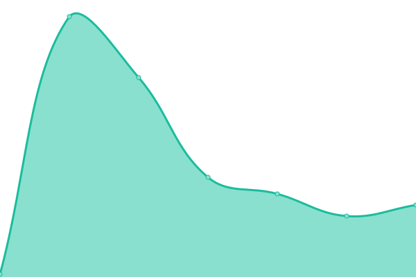
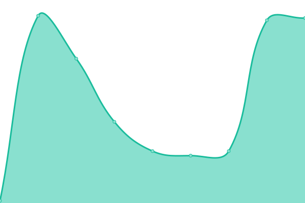
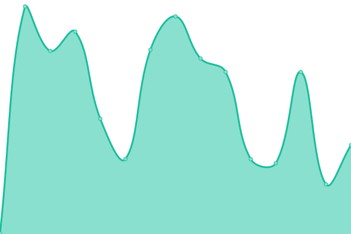
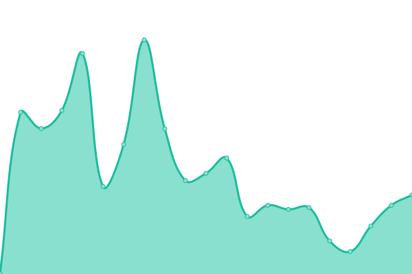
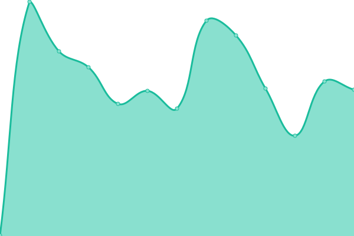
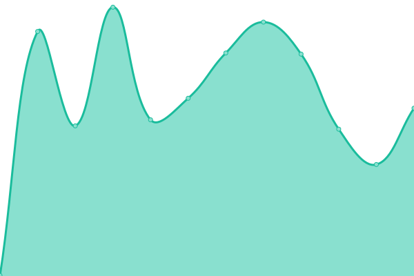

# [📈 Live Status](https://mikepell007.github.io/uptime): <!--live status--> **🟧 Partial outage**

This repository contains the open-source uptime monitor and status page for [mikepell007](https://mikepell007.github.io/uptime), powered by [Upptime](https://github.com/upptime/upptime).

With [Upptime](https://upptime.js.org), you can get your own unlimited and free uptime monitor and status page, powered entirely by a GitHub repository. We use [Issues](https://github.com/mikepell007/uptime/issues) as incident reports, [Actions](https://github.com/mikepell007/uptime/actions) as uptime monitors, and [Pages](https://mikepell007.github.io/uptime) for the status page.

<!--start: status pages-->
<!-- This summary is generated by Upptime (https://github.com/upptime/upptime) -->
<!-- Do not edit this manually, your changes will be overwritten -->
<!-- prettier-ignore -->
| URL | Status | History | Response Time | Uptime |
| --- | ------ | ------- | ------------- | ------ |
|  BI | 🟥 Down | [bi.yml](https://github.com/mikepell007/uptime/commits/HEAD/history/bi.yml) | 

 94ms
     
 | 

<a href="https://mikepell007.github.io/uptime/history/bi">98.25%</a>
    

|  EDI | 🟥 Down | [edi.yml](https://github.com/mikepell007/uptime/commits/HEAD/history/edi.yml) | 

 83ms
     
 | 

<a href="https://mikepell007.github.io/uptime/history/edi">98.25%</a>
    

|  Cams | 🟩 Up | [cams.yml](https://github.com/mikepell007/uptime/commits/HEAD/history/cams.yml) | 

 439ms
     
 | 

<a href="https://mikepell007.github.io/uptime/history/cams">100.00%</a>
    

|  Files | 🟩 Up | [files.yml](https://github.com/mikepell007/uptime/commits/HEAD/history/files.yml) | 

 401ms
     
 | 

<a href="https://mikepell007.github.io/uptime/history/files">100.00%</a>
    

|  ForgeJo | 🟩 Up | [forge-jo.yml](https://github.com/mikepell007/uptime/commits/HEAD/history/forge-jo.yml) | 

 464ms
     
 | 

<a href="https://mikepell007.github.io/uptime/history/forge-jo">100.00%</a>
    

|  FreshRSS | 🟩 Up | [fresh-rss.yml](https://github.com/mikepell007/uptime/commits/HEAD/history/fresh-rss.yml) | 

 311ms
     
 | 

<a href="https://mikepell007.github.io/uptime/history/fresh-rss">100.00%</a>
    

|  Graylog | 🟩 Up | [graylog.yml](https://github.com/mikepell007/uptime/commits/HEAD/history/graylog.yml) | 

 507ms
     
 | 

<a href="https://mikepell007.github.io/uptime/history/graylog">100.00%</a>
    

|  HA | 🟩 Up | [ha.yml](https://github.com/mikepell007/uptime/commits/HEAD/history/ha.yml) | 

 337ms
     
 | 

<a href="https://mikepell007.github.io/uptime/history/ha">100.00%</a>
    

|  Naemon | 🟩 Up | [naemon.yml](https://github.com/mikepell007/uptime/commits/HEAD/history/naemon.yml) | 

 394ms
     
 | 

<a href="https://mikepell007.github.io/uptime/history/naemon">100.00%</a>
    

|  Nextcloud | 🟩 Up | [nextcloud.yml](https://github.com/mikepell007/uptime/commits/HEAD/history/nextcloud.yml) | 

 757ms
     
 | 

<a href="https://mikepell007.github.io/uptime/history/nextcloud">100.00%</a>
    

|  Notes | 🟩 Up | [notes.yml](https://github.com/mikepell007/uptime/commits/HEAD/history/notes.yml) | 

 305ms
     
 | 

<a href="https://mikepell007.github.io/uptime/history/notes">100.00%</a>
    

|  Remote | 🟩 Up | [remote.yml](https://github.com/mikepell007/uptime/commits/HEAD/history/remote.yml) | 

 371ms
     
 | 

<a href="https://mikepell007.github.io/uptime/history/remote">100.00%</a>
    

<!--end: status pages-->

[**Visit our status website →**](https://mikepell007.github.io/uptime)

## 📄 License

- Powered by: [Upptime](https://github.com/upptime/upptime)
- Code: [MIT](./LICENSE) © [Anand Chowdhary](https://anandchowdhary.com), supported by [Pabio](https://pabio.com)
- Data in the `./history` directory: [Open Database License](https://opendatacommons.org/licenses/odbl/1-0/)
